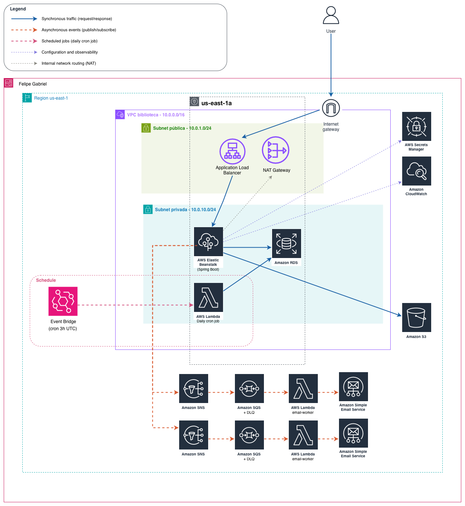

# Library — Digital Library Management System

A RESTful API for managing a digital library, built with Java 17 and Spring Boot 3.x, fully deployed on AWS using Infrastructure as Code with CloudFormation.

The system handles book borrowing, reservations, overdue fines, and automated email notifications through an event-driven architecture.

---

## Architecture



---

## Infrastructure as Code

The entire infrastructure is provisioned using a single **AWS CloudFormation** template (`cloudformation/biblioteca-master-final-v2.yaml`), following Infrastructure as Code (IaC) principles.

This means the full environment — VPC, subnets, RDS, S3, SNS, SQS, Lambdas, EventBridge, Secrets Manager and Elastic Beanstalk — can be created or destroyed with a single stack deployment. There are no manual steps required to provision infrastructure.

---

## Deployment Model — IaaS, PaaS and SaaS

This project uses a combination of AWS deployment models across the full stack:

**IaaS — Infrastructure as a Service**
- **VPC, Subnets, Security Groups, NAT Gateway and Internet Gateway** — the network layer is fully controlled and configured. Route tables, CIDR blocks, availability zones and traffic rules are defined explicitly in CloudFormation. AWS provides the underlying hardware and networking infrastructure, but the configuration and management are the developer's responsibility.
- **EC2** (managed by Elastic Beanstalk) — the virtual machine that runs the Spring Boot application. CPU, memory and instance type are configured explicitly.

**PaaS — Platform as a Service**
- **Elastic Beanstalk** manages the EC2 instance, OS, Java runtime, nginx reverse proxy, auto-healing and CloudWatch log streaming automatically. The application is deployed as a JAR — no server configuration required.
- **RDS** provides a fully managed MySQL database with automated backups, patching and failover — no database administration required.
- **Lambda** — serverless compute. The runtime, scaling and execution environment are fully managed by AWS. Only the function code and configuration are provided.

**SaaS — Software as a Service**
- **SNS** (Simple Notification Service) — fully managed pub/sub messaging. Topics, subscriptions and message delivery are handled entirely by AWS.
- **SQS** (Simple Queue Service) — fully managed message queuing with dead-letter queues, visibility timeout and retry policies configured declaratively.
- **SES** (Simple Email Service) — fully managed email delivery used by the Lambda functions to send transactional emails.
- **Secrets Manager** — fully managed secrets storage. The application retrieves RDS credentials at runtime without storing them in configuration files.
- **EventBridge** — fully managed event scheduling. The daily cron job that triggers the fine-batch Lambda is configured as a rule — no cron server required.
- **CloudWatch** — fully managed observability. Log ingestion, storage and querying are provided as a service.

---

## AWS Services

### Elastic Beanstalk
Hosts the Spring Boot API. Configured as a **SingleInstance** environment (no Load Balancer) with the EC2 instance running in a public subnet. The platform handles OS updates, Java runtime, nginx configuration and CloudWatch log streaming automatically.

### RDS MySQL 8.0
Relational database provisioned inside the VPC. The DB credentials are never stored in application properties — they are stored in **Secrets Manager** and fetched at application startup.

### Secrets Manager
Stores the RDS credentials (host, port, database name, username and password) as a JSON secret. The Elastic Beanstalk EC2 instance has an IAM policy that allows `secretsmanager:GetSecretValue` on the specific secret ARN. The `DataSourceConfig` class fetches the secret at startup and configures the HikariCP connection pool dynamically.

### S3
Stores book cover images and user profile pictures. The bucket is configured with public read access and CORS rules. Images are uploaded by the Spring Boot application using the AWS SDK v2 `S3Client`.

### SNS + SQS (Event-driven notifications)
The API publishes events to SNS topics instead of sending emails directly. Each topic has an SQS queue as a subscriber. This provides:
- **Decoupling** — the API does not wait for the email to be sent
- **Retry logic** — SQS retries failed messages up to 3 times before sending to the Dead Letter Queue
- **Resilience** — if the Lambda fails, the message is not lost

Three notification flows:

| Event | SNS Topic | Lambda |
|---|---|---|
| User registered | `biblioteca-user-registered` | `welcome-email` |
| Password recovery requested | `biblioteca-password-recover` | `recover-email` |
| Reserved book became available | `biblioteca-book-returned` | `reservation-email` |

### Lambda (Node.js 20.x)
Four Lambda functions:
- **welcome-email** — sends a welcome email when a new user registers
- **recover-email** — sends a password recovery link
- **reservation-email** — notifies a user when their reserved book becomes available
- **fine-batch** — runs daily, queries RDS for overdue loans, calculates fines (`days overdue × fine per day`) and sends a fine notification email via SES

The email Lambdas use `@aws-sdk/client-ses` which is built into the Node.js 20.x runtime — no `node_modules` needed. The `fine-batch` Lambda connects directly to RDS via `mysql2` and reads credentials from Secrets Manager.

### EventBridge
Triggers the `fine-batch` Lambda on a scheduled basis using a cron expression. Configured as `rate(3 minutes)` for testing — should be changed to `cron(0 0 * * ? *)` (daily at midnight UTC) for production.

### VPC
A custom VPC (`10.0.0.0/16`) with:
- 2 public subnets (AZ1 and AZ2) — Elastic Beanstalk EC2 and RDS
- 2 private subnets (AZ1 and AZ2) — fine-batch Lambda
- NAT Gateway — allows the private Lambda to reach the internet (SES, Secrets Manager)
- Internet Gateway — public traffic
- Separate Security Groups for RDS, Beanstalk and Lambda batch

### CloudWatch
Receives application logs streamed from Elastic Beanstalk (`StreamLogs: true`). Logs available at:
```
/aws/elasticbeanstalk/biblioteca-env-{Environment}/var/log/web.stdout.log
```

---

## Tech Stack

**Backend**
- Java 17
- Spring Boot 3.x
- Spring Security — OAuth2 Authorization Server + Resource Server (JWT/RSA)
- Spring Data JPA + Hibernate
- HikariCP
- MySQL (production) / H2 (local)
- Lombok
- AWS SDK v2 (SNS, S3, Secrets Manager)

**API Documentation**
- SpringDoc OpenAPI (springdoc-openapi-starter-webmvc-ui 2.6.0)
- Swagger UI — interactive API documentation with Bearer JWT authentication
- OpenAPI 3.0 specification with `@Schema`, `@Operation`, `@ApiResponses` annotations

**Testing**
- JUnit 5 (Jupiter)
- Mockito — unit testing with mocks for all service layers
- Spring Test — `MockMultipartFile`, `ReflectionTestUtils`, `SecurityContextHolder`

**AWS**
- Elastic Beanstalk (PaaS)
- RDS MySQL 8.0 (PaaS)
- Secrets Manager (SaaS)
- S3 (SaaS)
- SNS + SQS (SaaS)
- Lambda Node.js 20.x
- SES (SaaS)
- EventBridge (SaaS)
- CloudFormation (IaC)
- CloudWatch (SaaS)
- VPC, Subnets, NAT Gateway, Security Groups

---

## Project Structure

```
backend/
└── library/
    └── src/
        ├── main/java/com/library/
        │   ├── config/
        │   │   ├── AuthorizationServerConfig.java
        │   │   ├── ResourceServerConfig.java
        │   │   ├── aws/
        │   │   │   ├── DataSourceConfig.java
        │   │   │   ├── S3Config.java
        │   │   │   └── SnsConfig.java
        │   │   ├── customgrant/
        │   │   └── swagger/
        │   │       └── OpenApiConfig.java
        │   ├── controllers/                     # Interfaces with Swagger annotations
        │   │   ├── IAuthController.java
        │   │   ├── IBookController.java
        │   │   ├── ICategoryController.java
        │   │   ├── ILoanController.java
        │   │   ├── IReservationController.java
        │   │   ├── IUserController.java
        │   │   ├── exception/
        │   │   └── impl/                        # Controller implementations (clean)
        │   │       ├── AuthControllerImpl.java
        │   │       ├── BookControllerImpl.java
        │   │       ├── CategoryControllerImpl.java
        │   │       ├── LoanControllerImpl.java
        │   │       ├── ReservationControllerImpl.java
        │   │       └── UserControllerImpl.java
        │   ├── dtos/                            # DTOs with @Schema annotations
        │   │   ├── auth/
        │   │   ├── book/
        │   │   ├── category/
        │   │   ├── loan/
        │   │   ├── reservation/
        │   │   └── user/
        │   ├── models/
        │   │   ├── entities/
        │   │   └── repositories/
        │   ├── publisher/
        │   ├── projections/
        │   └── services/
        │       ├── aws/
        │       ├── exceptions/
        │       ├── impl/
        │       └── validation/
        └── test/java/com/library/
            ├── factories/                       # Test factories (pattern)
            │   ├── BookFactory.java
            │   ├── CategoryFactory.java
            │   ├── LoanFactory.java
            │   ├── ReservationFactory.java
            │   └── UserFactory.java
            └── services/                        # Unit tests (JUnit 5 + Mockito)
                ├── impl/
                │   ├── AuthServiceImplTest.java
                │   ├── BookServiceImplTest.java
                │   ├── CategoryServiceImplTest.java
                │   ├── LoanServiceImplTest.java
                │   ├── ReservationServiceImplTest.java
                │   └── UserServiceImplTest.java
                └── aws/
                    ├── S3ServiceTest.java
                    └── AwsSecretsServiceTest.java

lambdas/
├── welcome/
├── recover/
├── reservation/
└── fine-batch/

cloudformation/
└── biblioteca-master-final-v2.yaml

drawio/
├── Library-AWSArchitecture.drawio
└── Library-AWSArchitecture.drawio.png

postman/
├── Biblioteca_API_postman_collection.json
└── Biblioteca_API_environment.json
```

---

## API Documentation (Swagger)

The API is fully documented using **SpringDoc OpenAPI 3.0** with an interactive Swagger UI.

**Access:**
```
Swagger UI:    http://localhost:8080/swagger-ui.html
OpenAPI JSON:  http://localhost:8080/v3/api-docs
```

**Architecture pattern:** controller interfaces (`IAuthController`, `IBookController`, etc.) hold all Swagger annotations (`@Tag`, `@Operation`, `@ApiResponses`, `@SecurityRequirement`, `@Parameter`), while the implementations (`AuthControllerImpl`, `BookControllerImpl`, etc.) contain only the business logic — keeping the code clean and the documentation separated.

**Authentication in Swagger UI:**
1. Obtain a token via `POST /oauth2/token` (use Postman or curl with Basic Auth)
2. Click the **Authorize** button in Swagger UI
3. Paste the `access_token` value
4. All protected endpoints will include the `Authorization: Bearer ...` header automatically

---

## Testing

The project includes a comprehensive unit test suite covering all service layers.

**Structure:** follows the DSCommerce pattern with factory classes for entity creation and `@BeforeEach` setup.

| Test Class | Tests | Coverage |
|---|---|---|
| `CategoryServiceImplTest` | 11 | All CRUD operations + duplicate name + FK violation |
| `BookServiceImplTest` | 21 | CRUD + ISBN validation + media upload/replace + year validation |
| `LoanServiceImplTest` | 20 | Register + return + overdue processing + business rules (max loans, duplicate, availability) |
| `ReservationServiceImplTest` | 11 | Create + cancel + notification + business rules (available book, duplicate) |
| `AuthServiceImplTest` | 7 | Token creation + password reset + token validation + expiration |
| `UserServiceImplTest` | 18 | CRUD + JWT authentication + profile picture upload/replace + loadUserByUsername |
| `S3ServiceTest` | 8 | Upload + delete + file type/size validation |
| `AwsSecretsServiceTest` | 3 | Secret retrieval + not found + invalid JSON |

**Run tests:**
```bash
cd backend/library
mvn test
```

---

## Domain Model

### Entities

| Entity | Fields |
|---|---|
| `User` | id, name, email, password, avatarUrl |
| `Role` | id, authority (`ROLE_ADMIN`, `ROLE_USER`) |
| `Category` | id, name, description |
| `Book` | id, title, author, publisher, publicationYear, isbn, totalCopies, availableCopies, coverUrl |
| `Media` | url, position |
| `Loan` | id, borrowedAt, dueDate, returnedAt, status, overdueSince, fineAmount, fineCalculatedAt, overdueNotificationCount |
| `Reservation` | id, reservedAt, status |
| `PasswordRecover` | id, token, email, expiration |

### Relationships

```
User (ManyToMany) ──── Role            via tb_user_role
User (OneToMany)  ──── Loan
User (OneToMany)  ──── Reservation
Book (ManyToOne)  ──── Category
Book (OneToMany)  ──── Media
Loan (ManyToOne)  ──── User
Loan (ManyToOne)  ──── Book
Reservation (ManyToOne) ──── User
Reservation (ManyToOne) ──── Book
```

### Status Transitions

```
Loan:        ACTIVE ──── OVERDUE ──── RETURNED

Reservation: ACTIVE ──── NOTIFIED
                    └─── CANCELLED
```

### Business Rules

| Rule | Value |
|---|---|
| Max active loans per user | 3 |
| Loan duration | 7 days |
| Fine per overdue day | R$ 1.00 (configurable) |
| Password recovery token expiration | 30 minutes (configurable) |
| Reservation only allowed when | `availableCopies = 0` |
| On book return | notifies all users with `ACTIVE` reservations via SNS |

---

## API Endpoints

Base URL: `https://library-env.us-east-1.elasticbeanstalk.com`

Interactive documentation: `/swagger-ui.html`

### Authentication
| Method | Endpoint | Auth | Description |
|---|---|---|---|
| POST | `/oauth2/token` | Basic (clientId/clientSecret) | Login — returns JWT |
| POST | `/auth/recover-token` | Public | Request password recovery email |
| PUT | `/auth/new-password` | Public | Reset password using recovery token |
| GET | `/auth/validate-token` | Public | Validate recovery token |

### Users
| Method | Endpoint | Auth | Description |
|---|---|---|---|
| POST | `/users` | Public | Register new user |
| GET | `/users/me` | User/Admin | Get authenticated user |
| GET | `/users` | Admin | List all users |
| GET | `/users/{id}` | Admin | Get user by ID |
| GET | `/users/email/{email}` | Admin | Search users by email |
| PUT | `/users/{id}` | Admin | Update user |
| DELETE | `/users/{id}` | Admin | Delete user |

### Categories
| Method | Endpoint | Auth | Description |
|---|---|---|---|
| GET | `/categories` | Public | List all categories |
| GET | `/categories/{id}` | Public | Get category by ID |
| GET | `/categories/search/{name}` | Public | Search categories by name |
| POST | `/categories` | Admin | Create category |
| PUT | `/categories/{id}` | Admin | Update category |
| DELETE | `/categories/{id}` | Admin | Delete category |

### Books
| Method | Endpoint | Auth | Description |
|---|---|---|---|
| GET | `/books` | Public | List all books |
| GET | `/books/{id}` | Public | Get book by ID |
| GET | `/books/search?query=` | Public | Search by title or author |
| GET | `/books/available` | Public | List books with available copies |
| GET | `/books/category/{id}` | Public | List books by category |
| POST | `/books` | Admin | Create book (supports image upload) |
| PUT | `/books/{id}` | Admin | Update book |
| DELETE | `/books/{id}` | Admin | Delete book |

### Loans
| Method | Endpoint | Auth | Description |
|---|---|---|---|
| GET | `/loans/{id}` | Admin | Get loan by ID |
| GET | `/loans/user/{userId}` | Admin | Get loans by user |
| GET | `/loans/user/{userId}/status/{status}` | Admin | Get loans by user and status |
| GET | `/loans/status/{status}` | Admin | Filter loans by status |
| GET | `/loans/overdue` | Admin | List overdue loans |
| GET | `/loans/count/status/{status}` | Admin | Count loans by status |
| POST | `/loans/book/{bookId}` | User/Admin | Borrow a book |
| PUT | `/loans/{id}/return` | User/Admin | Return a book |
| POST | `/loans/process-overdue` | Admin | Manually mark loans as overdue |

### Reservations
| Method | Endpoint | Auth | Description |
|---|---|---|---|
| GET | `/reservations/{id}` | Admin | Get reservation by ID |
| GET | `/reservations/user/{userId}` | Admin | Get reservations by user |
| GET | `/reservations/book/{bookId}` | Admin | Get active reservations by book |
| POST | `/reservations/book/{bookId}` | User/Admin | Create reservation |
| PUT | `/reservations/{id}/cancel` | User/Admin | Cancel reservation |

---

## Running Locally

### Prerequisites
- Java 17
- Maven 3.8+
- AWS account with SNS, S3 and SES configured

### Setup

```bash
git clone https://github.com/FelipeGabrill/Library-SpringBoot-AWS.git
cd Library-SpringBoot-AWS/backend/library
```

The project uses Spring profiles to switch between environments:

| File | Environment | Database |
|---|---|---|
| `application.properties` | Base config (all environments) | — |
| `application-test.properties` | Local development | H2 in-memory |
| `application-dev.properties` | Development | H2 in-memory |
| `application-prod.properties` | Production (AWS) | RDS MySQL via Secrets Manager |

Configure `application-test.properties` with your AWS credentials:

```properties
cloud.aws.region.static=us-east-1
cloud.aws.credentials.access-key=YOUR_ACCESS_KEY
cloud.aws.credentials.secret-key=YOUR_SECRET_KEY
aws.sns.user-created.topic-arn=YOUR_SNS_ARN
aws.sns.password-recovery.topic-arn=YOUR_SNS_ARN
aws.sns.book-available.topic-arn=YOUR_SNS_ARN
aws.s3.bucket-name=YOUR_BUCKET_NAME
```

Run the application:

```bash
mvn spring-boot:run
```

The application starts on `http://localhost:8080` with an H2 in-memory database.
H2 console available at `http://localhost:8080/h2-console`.

---

## Deploying to AWS

### Prerequisites
- AWS CLI configured
- SES email verified
- Bucket `biblioteca-deploy-{ACCOUNT_ID}` created with the following structure:

```
biblioteca-deploy-{ACCOUNT_ID}/
├── app/
│   └── library-0.0.1-SNAPSHOT.jar
└── lambdas/
    ├── welcome.zip
    ├── recover.zip
    ├── reservation.zip
    └── fine-batch.zip
```

### 1. Build the JAR and upload to S3

```bash
cd backend/library
mvn clean package -DskipTests

aws s3 cp target/library-0.0.1-SNAPSHOT.jar \
    s3://biblioteca-deploy-{ACCOUNT_ID}/app/library-0.0.1-SNAPSHOT.jar
```

### 2. Package and upload the Lambdas

**Email Lambdas** — `@aws-sdk/client-ses` is built into the Node.js 20.x runtime, no `npm install` needed:

```bash
cd lambdas/welcome && zip -r ../../welcome.zip . && cd ../..
cd lambdas/recover && zip -r ../../recover.zip . && cd ../..
cd lambdas/reservation && zip -r ../../reservation.zip . && cd ../..

aws s3 cp welcome.zip s3://biblioteca-deploy-{ACCOUNT_ID}/lambdas/welcome.zip
aws s3 cp recover.zip s3://biblioteca-deploy-{ACCOUNT_ID}/lambdas/recover.zip
aws s3 cp reservation.zip s3://biblioteca-deploy-{ACCOUNT_ID}/lambdas/reservation.zip
```

**fine-batch Lambda** — requires `mysql2`, must be bundled:

```bash
cd lambdas/fine-batch
npm install
zip -r ../../fine-batch.zip .
cd ../..

aws s3 cp fine-batch.zip s3://biblioteca-deploy-{ACCOUNT_ID}/lambdas/fine-batch.zip
```

### 3. Deploy CloudFormation stack

```
AWS Console → CloudFormation → Create stack
  → Upload: cloudformation/biblioteca-master-final-v2.yaml
  → Stack name: biblioteca-master-test
```

| Parameter | Description |
|---|---|
| `Environment` | Label for resource naming (e.g. `test`) |
| `DeployBucket` | Bucket with the JAR and Lambda ZIPs |
| `SesFromEmail` | Verified SES email address |
| `AWSAccessKey` | IAM user access key |
| `AWSSecretKey` | IAM user secret key |
| `DBPassword` | Min 8 chars, no `/` `@` `"` or spaces |

Check **I acknowledge that AWS CloudFormation might create IAM resources** and click **Submit**.

The stack takes ~10 minutes to create. RDS provisioning is the bottleneck.

### 4. Seed the database

The application automatically seeds the database on startup using `import.sql` with `MERGE INTO` statements (compatible with both H2 and MySQL). The seed creates the default roles (`ROLE_ADMIN`, `ROLE_USER`) and an admin user.

To verify manually, get the RDS endpoint from the stack Outputs, add your IP to the RDS Security Group inbound rules and connect:

```bash
mysql -h YOUR_RDS_ENDPOINT -P 3306 -u admin -p biblioteca
```

### 5. Test the API

Get the `BeanstalkURL` from the stack Outputs and import the Postman files from the `postman/` folder. Select the `Biblioteca API - Local` environment, run **Login** and the token is saved automatically.

Alternatively, access the **Swagger UI** at `{BeanstalkURL}/swagger-ui.html` for interactive documentation.

---

## Postman

The collection includes pre-configured scripts that automatically save tokens and IDs to the environment after each request.

| Request | Auto-saved variable |
|---|---|
| Login | `token` |
| Insert User | `userId` |
| Insert Category | `categoryId` |
| Insert Book | `bookId` |
| Register Loan | `loanId` |
| Create Reservation | `reservationId` |

---

## Author

**Felipe Gabriel**
